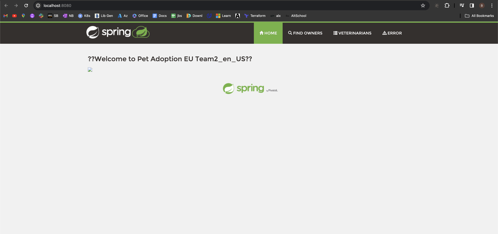
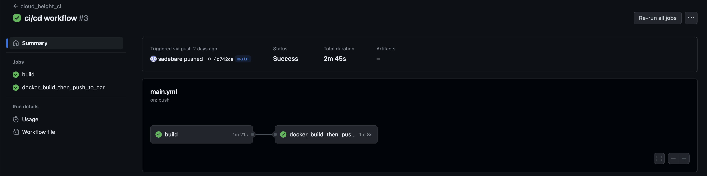
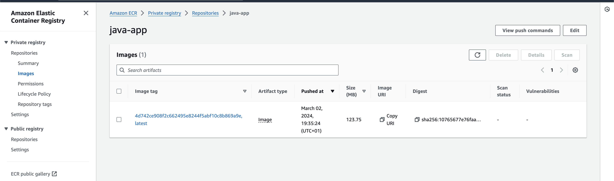
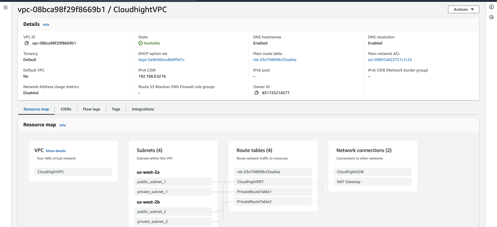
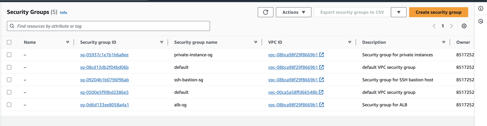
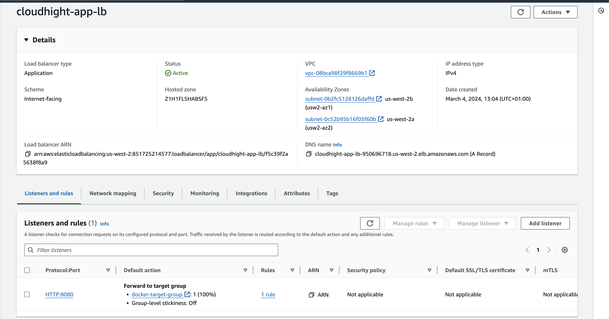
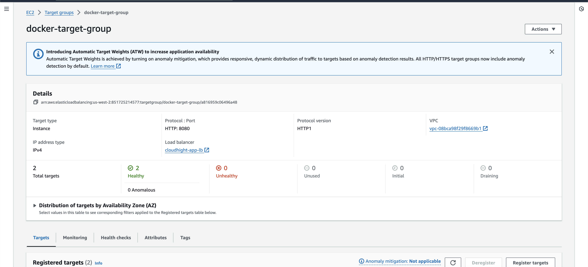
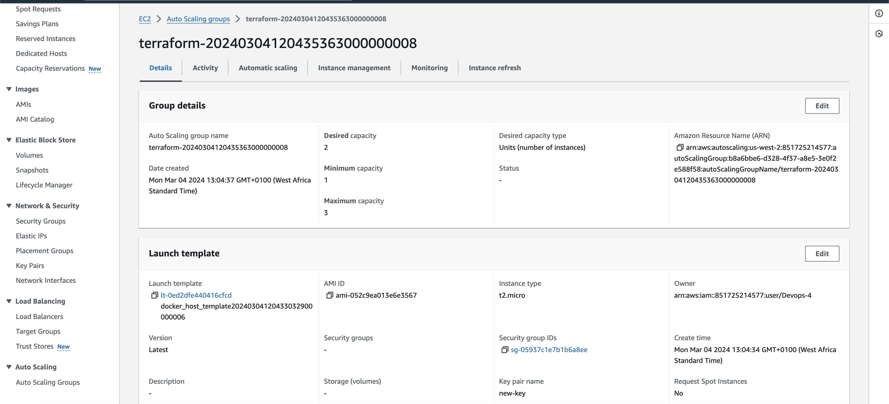
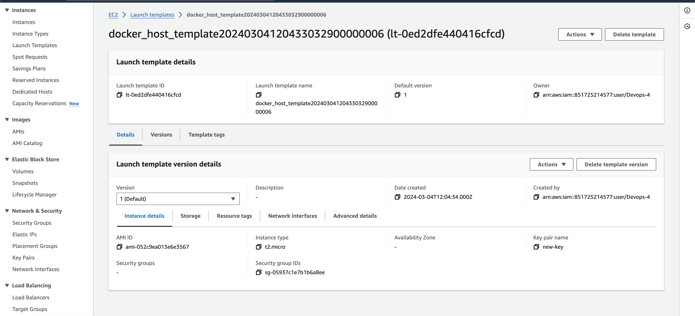
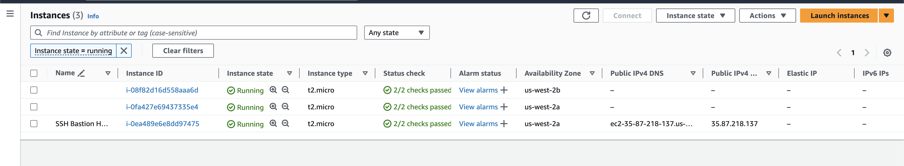

# Task 1: Containerization And CI (contineous integration)
## Let's go through the containerization of the java application and running the docker image on the local development
+   a. We begin by creating a [Dockerfile](./Dockerfile) using the command

        docker build . -t java-app

        #check if the docker actually built successfully
        docker images

    +   After successful build, we can run the application application using the command

                docker run -dp 8080:8080 java-app
    +   We can now access our application locally going to the url http://localhost:8080/
    

+    b. Moving forward to the contineous integration, i will be making use of Github action for this project and also private ECR for storing our images
    +   The CI pipeline can be found [here](./.github/workflows/main.yml), with this pipeline, we were able to build the application locally after which was dockerized and pushed to the private ECR
    

        +  We can then verify if the image was successfully pushed by going to the AWS ECR, to confirm

        
+    **NB:** in my ci pipeline, i pushed 2 docker images to the ECR, one with the latest tag and the other with a random tag, in case of rollback.

# Task 2: Infrastructure Provisioning
##      Below is a summary of what the terraform will provision
+   **VPC (Virtual Private Cloud)**: 
    +  A VPC named "CloudhightVPC" with a specified CIDR block.
    +  Enabled DNS support and hostnames.

+   **Subnets**:
    +   Two public subnets named "public_subnet_1" and "public_subnet_2" associated with the VPC.
    +  Two private subnets named "private_subnet_1" and "private_subnet_2" associated with the VPC.
    +  Each subnet is associated with its respective route table.

+   **Security Groups:**
    +  Security group for SSH bastion host allowing inbound traffic on port 22 from anywhere.
    +  Security group for ALB (Application Load Balancer) allowing inbound traffic on port 8080 from anywhere.
    +  Security group for private instances allowing inbound traffic on ports 22 and 8080 from specific security groups and outbound traffic to anywhere.

+  **Internet Gateway:**
     +  An internet gateway named "CloudhightIGW" attached to the VPC.

+  **Route Tables:**
    +  Public route table associated with the public subnets, with a route to the internet gateway.
    +  Two private route tables associated with the private subnets.

+  **NAT Gateway:**
    +  A NAT Gateway named "NAT Gateway" associated with one of the public subnets.

+  **Elastic IP Address:**
    +  An Elastic IP address associated with the NAT Gateway.

+  **Load Balancer (ALB):**
    +  An Application Load Balancer named "cloudhight-app-lb" with specified subnets and security groups.
    +  A target group named "docker-target-group" associated with the ALB.

+  **Auto Scaling Group:**
    +  An Auto Scaling Group named "docker_asg" with desired, maximum, and minimum capacities.
    +  Configured with a launch template and associated target group for the ALB.

+  **IAM Policies and Roles:**
    +  IAM policy and role for ECR (Elastic Container Registry) access.
    +  IAM role and policy attachment for EC2 instance profile.

+  **Launch Template:**
    +  A launch template named "docker_host_template" for EC2 instances.

+  **SSH Bastion Host and two other private instances:**
    +  An EC2 instance named "SSH Bastion Host" with a specific AMI, instance type, subnet, and security group.
    +  We make sure we follow due process for private instances

###  Steps to make use of the terraform command
+   Initial with your aws credential by typing the below command on the terminal

        aws configure

+   Move to the terraform directory

        cd terraform
+   Initialize Terraform:

         terraform init
+   Plan Terraform:

         terraform plan
+   Execute the Terraform script which create resources in AWS:

         terraform apply
+   Destroy resources
        
        terraform destroy
